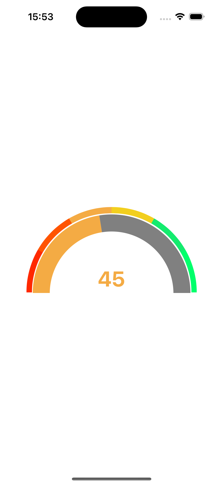
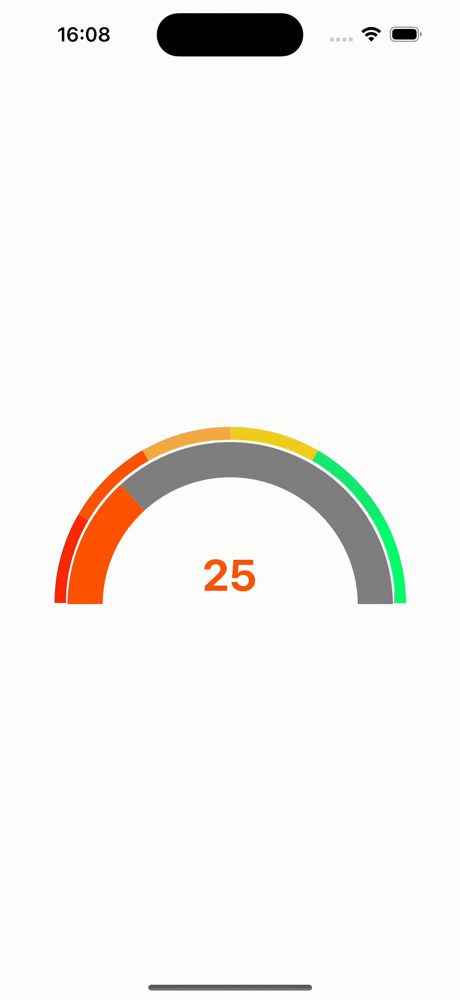

# rn-gauge-gradient





## Installation

```sh
npm install rn-gauge-gradient
```
OR
```sh
yarn add rn-gauge-gradient
```

## Usage

```js
import GaugeGradient from 'rn-gauge-gradient';

// ...

<GaugeGradient
    size={200}
    min={0}
    max={100}
    value={70}
    showText
    textValue="70%"
/>
```

## Contributing

See the [contributing guide](CONTRIBUTING.md) to learn how to contribute to the repository and the development workflow.

## License

MIT


